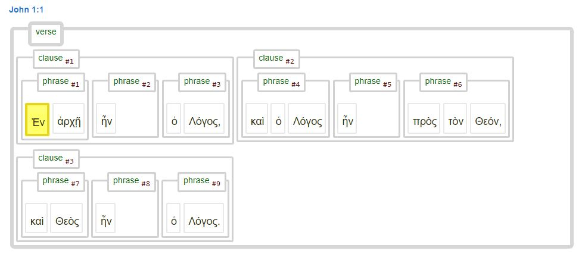
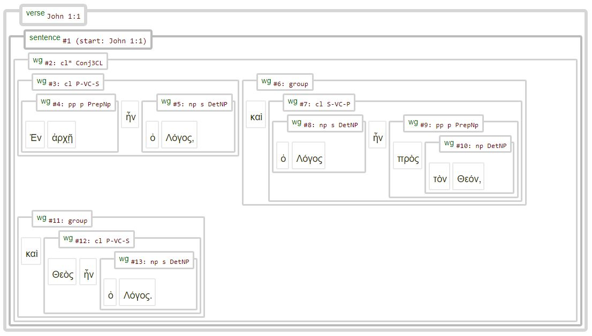
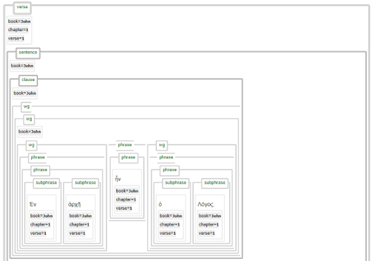
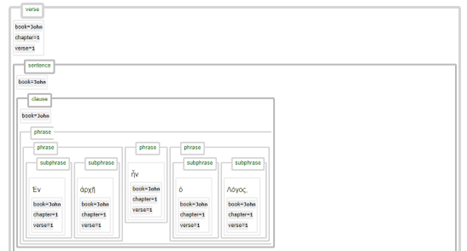

# About this dataset

This repository is part of a set of repositories dedicated to storing the code and data generated for the 'Nestle 1904 Text-Fabric conversion project'. One of the objectives of this project is to create a high-quality Text-Fabric presentation of the Treebank Nestle 1904 Greek New Testament, resembling the Text-Fabric implementation of the Hebrew Old Testament ([BHSA](https://github.com/ETCBC/bhsa)). The project is a collaboration between [ETCBC](https://github.com/ETCBC) (Vrije Universiteit Amsterdam) and [CBLC](https://github.com/CenterBLC) (Andrews University). 

The 'Nestle 1904 Text-Fabric conversion project' produced various Text-Fabric presentations of the Nestle 1904 Greek New Testament, including:
* Nestle1904GBI: [`Webpage`](https://tonyjurg.github.io/Nestle1904GBI/) [`Github`](https://github.com/tonyjurg/Nestle1904GBI)
* Nestle1904LFT: [`Webpage`](https://tonyjurg.github.io/Nestle1904LFT/) [`Github`](https://github.com/tonyjurg/Nestle1904LFT)
* tfgreek2 (test version for final product): [`Github`](https://github.com/saulocantanhede/tfgreek2)
* Nestle1904 (ETCBC version; planned): [`Github`](https://github.com/ETCBC/nestle1904)

Each version utilizes a different conversion method and/or employs different source data, resulting in a distinct set of features that have been tailored to its specific intended use.

## Differences between datasets

Each of these Text-Fabric implementations has distinct features and was created differently. The fundamental differences are in the following areas:

1. Type of source data (XML input data):
* [‘GBI nodes’](https://github.com/tonyjurg/Nestle1904GBI/tree/main/resources/sourcedata)
*	[‘Low Fat Tree’](https://github.com/tonyjurg/Nestle1904LFT/tree/main/resources/xml)

2. Production tools used to perform the conversion to Text-Fabric:
*	Module [tf.convert.walker](https://annotation.github.io/text-fabric/tf/convert/walker.html#tf.convert.walker) with dedicated director function).
*	Module [tf.convert.xml](https://annotation.github.io/text-fabric/tf/convert/xml.html#tf.convert.xml).

3. Level of syntactical information:
*	‘Basic implementation’: limited syntactical information (e.g., ‘subject’, ‘object’).
*	'Full implementation': includes all available syntactical information.

4. Method of handling syntactic information (as present in the LowFatTree data):
*	an almost ‘as found’ presentation of wordgroups (lacks ‘clause’ and ‘phrase’ nodes).
*	a significant amount of 'interpretation' by adding clauses and phrases.
*	'hybrid': offering option to present data either 'as found' or 'interpreted'. 

The following table shows how each of the previous mentioned Text-Fabric implementations relate to these areas:

Text-Fabric implementation | Source data | Production tool | Syntactic information | Handling syntactic info
--- | --- | --- | --- | ---
[Nestle1904GBI](https://tonyjurg.github.io/Nestle1904GBI/) | [‘GBI nodes’](https://github.com/tonyjurg/Nestle1904GBI/tree/main/resources/sourcedata) | [tf.convert.walker](https://annotation.github.io/text-fabric/tf/convert/walker.html#tf.convert.walker) | ‘Basic’ | 'interpretation' 
[Nestle1904LFT](https://tonyjurg.github.io/Nestle1904LFT/) | [‘Low Fat Tree’](https://github.com/tonyjurg/Nestle1904LFT/tree/main/resources/xml) | [tf.convert.walker](https://annotation.github.io/text-fabric/tf/convert/walker.html#tf.convert.walker) | 'Full' | ‘as found’ 
[tfgreek2](https://github.com/saulocantanhede/tfgreek2) | [‘Low Fat Tree’](https://github.com/tonyjurg/Nestle1904LFT/tree/main/resources/xml) | [tf.convert.xml](https://annotation.github.io/text-fabric/tf/convert/xml.html#tf.convert.xml)] | 'Full' | 'hybrid'
[Nestle1904](https://github.com/ETCBC/nestle1904) | [‘Low Fat Tree’](https://github.com/tonyjurg/Nestle1904LFT/tree/main/resources/xml) | [tf.convert.xml](https://annotation.github.io/text-fabric/tf/convert/xml.html#tf.convert.xml)] | 'Full' | 'hybrid'

## Syntax tree presentation

An important aspect of the 'Nestle 1904 Text-Fabric conversion project' was to create a dataset that would allow for rendering syntax trees. A syntax tree is a graphical representation that depicts the syntactic structure of a sentence or phrase. It is a hierarchical tree-like structure that illustrates how different words in a sentence are grammatically connected to each other. In a syntax tree, each word (or morpheme) is represented as a node, and the relationships between words are depicted as branches or edges connecting these nodes. The tree starts with the main clause or the root node and branches out to represent subordinate clauses, phrases, and individual words. The tree structure reflects the hierarchical arrangement of grammatical elements within the sentence. The syntax tree provides valuable insights into the sentence's grammatical structure, including the roles of nouns, verbs, adjectives, prepositions, conjunctions, and other parts of speech. It helps linguists, language learners, and researchers analyze the sentence's syntax, identify grammatical patterns, and understand how words function within the sentence. 

There are various implementations for syntax trees, each according to their own philosophy. See [here](https://jonathanrobie.biblicalhumanities.org/blog/2017/12/20/treebanks-for-ancient-greek/) for an overview by Jonathan Robie of 'nine kinds of Ancient Greek Treebanks' describing various types of syntax-trees with special focus on the Greek New Testament.

Regarding data structuring, distinct approaches were adopted for the Nestle1904GBI and the Nestle1904LFT Text-Fabric datasets. These choices, as outlined in the table provided in previous section, not only affect query structuring but also influence the presentation of results. The syntax tree representations of John 1:1 provided below offer a clear illustration of these differences.

## The Text-Fabric implementations compared

### The Nestle1904GBI implementation

The Nestle1904GBI implementation presents the syntactical structure in its most basic form. It is an interpretation of the underlying XML source data, and it converted 'word group' items into 'clause' or 'phrase' nodes, depending on the attributes associated with that 'word group' data. The syntactical data presented in this Text-Fabric implementation does not show explicitly some of the higher level syntactical elements like apposition containers. The following image shows the syntactical structure of John 1:1 using this data set.

### The Nestle1904LFT implementation

The Nestle1904LFT implementation stays very close to the underlying XML source data. Interpretation and modification of data has been limited to the bare minimum. The Nestle1904LFT implementation lacks the explict use of concepts like 'clause' or 'phrases' and only  uses the concept 'word group'. These 'word groups' can function as 'clause', 'phrase', a combination of conjunctions and clauses or other groups like apposition containers.

### The tfgreek2 / Nestle1904 (future ETCBC) implementation

This Text-Fabric dataset includes both the original 'wg' nodes containing word group data from the source XML, as well as the interpreted forms where each 'wg' node has been transformed into either a 'clause', 'phrase', or 'subphrase' node based on the original 'wg' data. By means of this interpretation, this dataset provides extensive additional information. Consequently, various syntax tree displays are possible. The subsequent subsections illustrate the three distinct views,  highlighting their fundamental differences

#### View 1: the combined view 

The following image shows the first clause of John 1:1. This view dislays all nodes included in the Text-Fabric data set for that this section of text. As can be seen, it contains a lot of elements.

#### View 2: syntactic view

When the display of 'word group' nodes is switched off, the tree contains all syntactical relevant detail, presented in a much easier to understand manner. The resulting syntax tree has some resemblance with the Nestle1904GBI implantation. Would the path of ‘syntactic interpretation’ be progressed further on that implementation, it would indeed have resulted in a similar presentation.

#### View 3: XML source view

When the display of 'clauses', 'phrases' and 'subphrases' is switched off, the tree is presented as found in the XML source data. The resulting syntax tree is similar with the Nestle1904LFT implantation. The main visual difference is that in the display of the Nestle1904LFT by default the syntactic details were displayed for each word group node

## Validity of data

When using a dataset for analysis or research, it is essential to assess whether it is fit for the intended purpose. In the case of this dataset, there is a crucial aspect to keep in mind. The dataset is based on an open-source project and utilizes the [Nestle 1904 edition](https://archive.org/details/the-greek-new-testament-nestle-1904-us-edition) of the Greek text of the New Testament (or more accurately, [the 1913 reprint](https://archive.org/details/hkainediathekete00lond). See also [this FAQ](https://sites.google.com/site/nestle1904/faq)). This version was chosen because its copyright has expired, making it available in the Public Domain. It is worth noting that the current standard version used in academic settings is the [Nestle-Aland edition 28](https://www.academic-bible.com/en/online-bibles/novum-testamentum-graece-na-28/read-the-bible-text/). Despite this, the Nestle 1904 provided by this Text-Fabric implementtion, is the closest version in terms of the ‘principal text’ available in the public domain, and suitable to perform syntactical analysis. 

